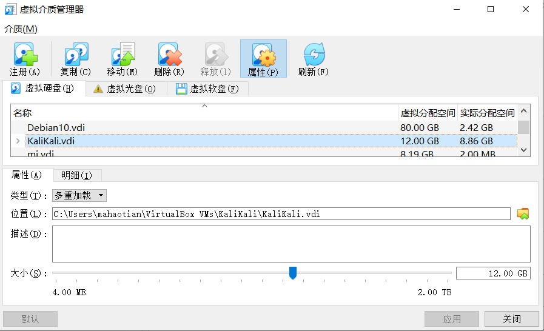
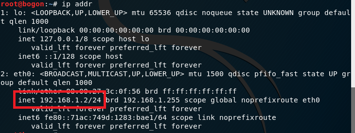
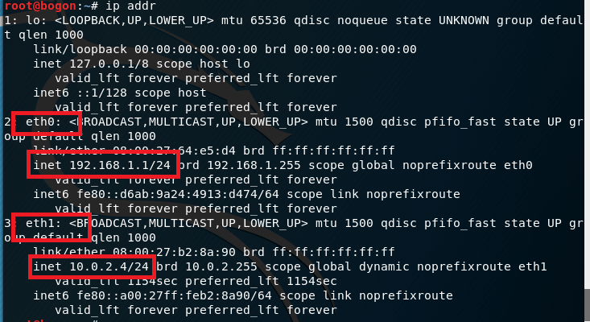
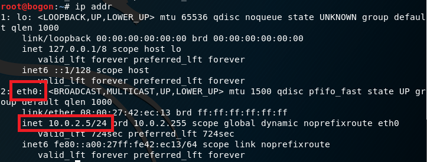
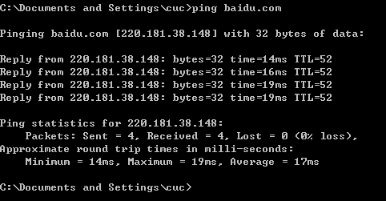
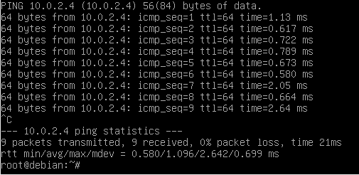
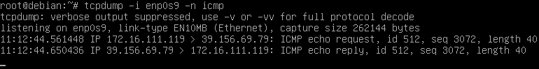
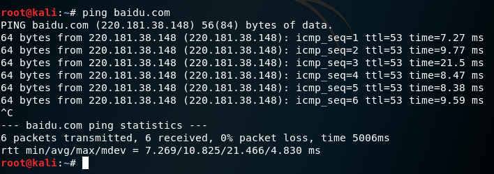
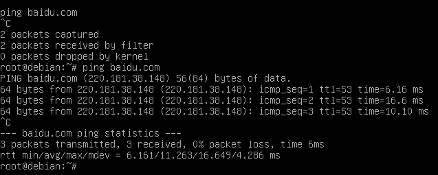

**基于VirtualBox的网络攻防基础环境搭建实例讲解**

**实验目的**
* 掌握 VirtualBox 虚拟机的安装与使用；
* 掌握 VirtualBox 的虚拟网络类型和按需配置；
* 掌握 VirtualBox 的虚拟硬盘多重加载；


**实验环境**: 
```
- VirtualBox 虚拟机
- 攻击者主机（Attacker）：Kali Rolling 2109.2
- 网关（Gateway, GW）：Debian Buster
- 靶机（Victim）：From Sqli to shell / xp-sp3 / Kali
```

**实验步骤**：

1.配置一块安装了kali的 .vdi 硬盘多重加载，并在virtualbox中新建三台虚拟机，分别设置为Victim、Gateway、Attacker。


2.分别给三台虚拟机添加网卡实现要求的功能。


**具体步骤说明**：

   一、配置一块安装了kali的 .vdi 硬盘多重加载，并在virtualbox中新建三台虚拟机，分别设置为Victim、Gateway、Attacker。
   
        首先释放对应的  .vdi 硬盘，然后将该硬盘的类型改为多重加载，然后新建虚拟机的时候选用多重加载的虚拟硬盘。
   
   
   二、分别给三台虚拟机添加网卡
   

配置成功截图：

Attacker




Gateway(debian，网卡1：NAT网络，网卡2：仅主机，网卡3：内部网络，网卡4：内部网络)




Victim



   
三、连通性测试

连通性验证截图如下:

 -  靶机可以直接访问攻击者主机
 
  
-  靶机可以上网



 -  攻击者主机无法直接访问靶机
 

 
 - 网关可以直接访问攻击者主机和靶机
 
 网关到靶机
 

网关到攻击者


 - 靶机的所有对外上下行流量必须经过网关
 

     
 -  所有节点均可以访问互联网





     
 


我遇到的问题：
- 网关无法ping通靶机。解决方法：步步排查错误，最终关闭靶机防火墙后得以解决。

