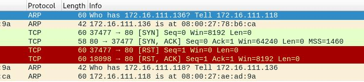
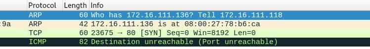
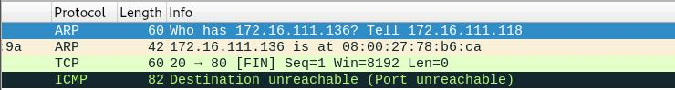
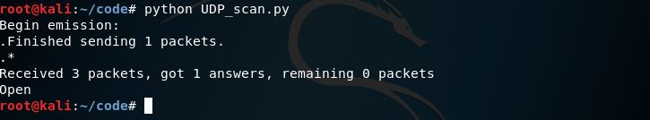

# 基于 Scapy 编写端口扫描器 #

## 实验目的 ##
- 掌握网络扫描之端口状态探测的基本原理

## 实验环境 ##
- python + scapy

## 实验要求 ##
- 禁止探测互联网上的 IP ，严格遵守网络安全相关法律法规
- 完成以下扫描技术的编程实现
  - TCP connect scan / TCP stealth scan
  - TCP Xmas scan / TCP fin scan / TCP null scan
  - UDP scan
- 上述每种扫描技术的实现测试均需要测试端口状态为：开放、关闭 和 过滤 状态时的程序执行结果
- 提供每一次扫描测试的抓包结果并分析与课本中的扫描方法原理是否相符？如果不同，试分析原因；
- 在实验报告中详细说明实验网络环境拓扑、被测试 IP 的端口状态是如何模拟的
- （可选）复刻 nmap 的上述扫描技术实现的命令行参数开关

## 实验过程 ##
## 一、实验拓扑结构 ##
- victim-kali

- Attacker-kali

## 二、实验具体实现 ##
1、TCP connect scan
- 端口关闭状态的测试
 - 查看此时处于端口状态，没有80端口，说明此时80端口处于关闭中

 - 在victim中开始抓包
   在Attacker中运行扫描文件TCP_connect_scan.py，停止抓包，存储在本地
   此时输出结果为closed，80端口关闭。

 - 分析靶机抓到的包，攻击者主机给靶机的80端口发送了设置SYN标志的TCP包，靶机发送给攻击者主机的返回包中设置了RST标志，证明了端口关闭。

- 端口开启状态的测试
 - 打开靶机的80端口监听

 - 在victim中开始抓包
   在Attacker中运行扫描文件TCP_connect_scan.py，停止抓包，存储在本地
   此时输出结果为open，80端口开启。

 - 分析靶机抓到的包，攻击者和靶机之间进行了完整的3次握手TCP通信（SYN, SYN/ACK, 和RST），并且该连接由靶机在最终握手中发送确认ACK+RST标志来建立，证明了端口打开。

- 端口过滤状态的测试
 - 将80端口设置为过滤状态

 - 在victim中开始抓包
   在Attacker中运行扫描文件TCP_connect_scan.py，停止抓包，存储在本地
   此时输出结果为filtered，80端口为过滤状态。

 - 分析靶机抓到的包，攻击者主机给靶机的80端口发送了设置SYN标志的TCP包，靶机未返回TCP数据包给攻击者，靶机返回给攻击者一个ICMP数据包，且该包类型为type3，证明了端口被过滤。

 2、TCP Stealth Scan
- 端口关闭状态的测试
 - 关闭防火墙 

 - 在victim中开始抓包
   在Attacker中运行扫描文件TCP_connect_scan.py，停止抓包，存储在本地
   此时输出结果为closed，80端口关闭。

 - 分析靶机抓到的包，攻击者主机给靶机的80端口发送了设置SYN标志的TCP包，靶机发送给攻击者主机的TCP返回包中设置了RST标志，证明了端口关闭。

- 端口开启状态的测试
 - 打开靶机的80端口监听

 - 在victim中开始抓包
   在Attacker中运行扫描文件TCP_stealth_scan.py，停止抓包，存储在本地
   此时输出结果为open，80端口开启。

 - 分析靶机抓到的包，前三个包类似于TCP连接扫描，完成了SYN, SYN/ACK, 和RST，且最后在TCP数据包中发送的是RST     标志而不是RST + ACK，证明了端口打开。

- 端口过滤状态的测试 
 - 在victim靶机设置80端口被防火墙过滤，确保设置成功

 - 在victim中开始抓包
   在Attacker中运行扫描文件TCP_stealth_scan.py，停止抓包，存储在本地
   此时输出结果为filtered，80端口为打开或被过滤状态。

 - 分析靶机抓到的包,攻击者主机给靶机的80端口发送了设置SYN标志的TCP包,靶机没有返回TCP数据包给攻击者主机
靶机返回给攻击者主机一个ICMP数据包，且该包类型为type3,证明了端口被过滤.

 3、TCP Xmas scan
- 端口关闭状态的测试
 - 查看此时处于端口状态，没有80端口，说明此时80端口处于关闭中

 - 在victim中开始抓包
   在Attacker中运行扫描文件TCP_xmas_scan.py，停止抓包，存储在本地
   此时输出结果为closed，80端口关闭。

 - 分析靶机抓到的包，攻击者主机给靶机的80端口发送了设置了PSH，FIN和URG标志的TCP数据包，靶机发送给攻击者主机的TCP返回包中设置了RST标志，证明了端口关闭。

- 端口开启状态的测试
 - 打开靶机的80端口监听

 - 在victim中开始抓包
   在Attacker中运行扫描文件TCP_xmas_scan.py，停止抓包，存储在本地
   此时输出结果为open | filtered，80端口为打开或被过滤状态。

 - 分析靶机抓到的包，攻击者主机给靶机的80端口发送了设置了PSH，FIN和URG标志的TCP数据包,靶机没有发送TCP包响应，无法区分其80端口打开/被过滤,但是靶机也没有发送ICMP数据包给攻击者主机，说明端口不是被过滤状态,由此证明了端口打开。

- 端口过滤状态的测试 
 - 在victim靶机设置80端口被防火墙过滤，确保设置成功

 - 在victim中开始抓包
   在Attacker中运行扫描文件TCP_xmas_scan.py，停止抓包，存储在本地
   此时输出结果为filtered，80端口为过滤状态。

 - 分析靶机抓到的包,攻击者主机给靶机的80端口发送了设置了PSH，FIN和URG标志的TCP数据包,靶机返回给靶机一个ICMP数据包，且该包类型为type3,证明了端口被过滤.

4、TCP fin scan
- 端口关闭状态的测试
 - 查看此时处于端口状态，没有80端口，说明此时80端口处于关闭中

 - 在victim中开始抓包
   在Attacker中运行扫描文件TCP_fin_scan.py，停止抓包，存储在本地
   此时输出结果为closed，80端口关闭。

 - 分析靶机抓到的包，攻击者主机给靶机的80端口发送了设置了FIN标志的TCP数据包，靶机发送给攻击者主机的TCP返回包中设置了RST标志，证明了端口关闭。

- 端口开启状态的测试
 - 打开靶机的80端口监听

 - 在victim中开始抓包
   在Attacker中运行扫描文件TCP_fin_scan.py，停止抓包，存储在本地
   此时输出结果为open | filtered，80端口为打开或被过滤状态。

 - 分析靶机抓到的包，攻击者主机给靶机的80端口发送了设置了FIN标志的TCP数据包，靶机没有发送TCP包响应，无法区分其80端口打开或被过滤，但是靶机也没有发送ICMP数据包给攻击者主机，说明端口不是被过滤状态，由此证明了端口打开。

- 端口过滤状态的测试 
 - 在victim靶机设置80端口被防火墙过滤，确保设置成功

 - **在victim中开始抓包**
   在Attacker中运行扫描文件TCP_fin_scan.py，停止抓包，存储在本地。此时输出结果为filtered，80端口为过滤状态。

 - 分析靶机抓到的包,攻击者主机给靶机的80端口发送了设置了FIN标志的TCP数据包，靶机返回给靶机一个ICMP数据包，且该包类型为type3，证明了端口被过滤。

5、TCP null scan
- 端口关闭状态的测试
 - 查看此时处于端口状态，没有80端口，说明此时80端口处于关闭中

 - 在victim中开始抓包
   在Attacker中运行扫描文件TCP_null_scan.py，停止抓包，存储在本地
   此时输出结果为closed，80端口关闭。

 - 分析靶机抓到的包，攻击者主机给靶机的80端口发送了一个没有任何标志位的TCP包，靶机发送给攻击者主机的TCP返回包中设置了RST标志，证明了端口关闭。

- 端口开启状态的测试
 - 打开靶机的80端口监听

 - 在victim中开始抓包
   在Attacker中运行扫描文件TCP_null_scan.py，停止抓包，存储在本地
   此时输出结果为open | filtered，80端口为打开或被过滤状态。

 - 分析靶机抓到的包，攻击者主机给靶机的80端口发送了一个没有任何标志位的TCP包，靶机没有发送TCP包响应，无法区分其80端口打开/被过滤。，但是靶机也没有发送ICMP数据包给攻击者主机，说明端口不是被过滤状态，由此证明了端口打开。

- 端口过滤状态的测试 
 - 在victim靶机设置80端口被防火墙过滤，确保设置成功

 - 在victim中开始抓包
   在Attacker中运行扫描文件TCP_null_scan.py，停止抓包，存储在本地
   此时输出结果为filtered，80端口为过滤状态。

 - 分析靶机抓到的包,攻击者主机给靶机的80端口发送了一个没有任何标志位的TCP包，靶机返回给靶机一个ICMP数据包，且该包类型为type3，证明了端口被过滤.

6、UDP scan
- 端口关闭状态的测试
 - 查看此时处于端口状态，没有80端口，说明此时80端口处于关闭中

 - 在victim中开始抓包
   在Attacker中运行扫描文件UDP_scan.py，停止抓包，存储在本地
   此时输出结果为closed，80端口关闭。

 - 分析靶机抓到的包，攻击者主机给靶机的80端口发送了UDP包，靶机响应ICMP端口不可达错误type3和code3，证明了端口关闭。

- 端口开启状态的测试
 - 打开靶机的80端口监听

 - 在victim中开始抓包
   在Attacker中运行扫描文件UDP_scan.py，停止抓包，存储在本地
   此时输出结果为open | filtered，80端口为打开或被过滤状态。

 - 分析靶机抓到的包，攻击者主机给靶机的80端口发送了UDP包，靶机响应ipv4包，由此证明了端口打开。

## 实验参考 ##
- https://github.com/CUCCS/2019-NS-Public-chencwx/blob/ns_chap0x05/ns_chapter5
- https://c4pr1c3.github.io/cuc-ns/chap0x05/main.html
- https://resources.infosecinstitute.com/port-scanning-using-scapy